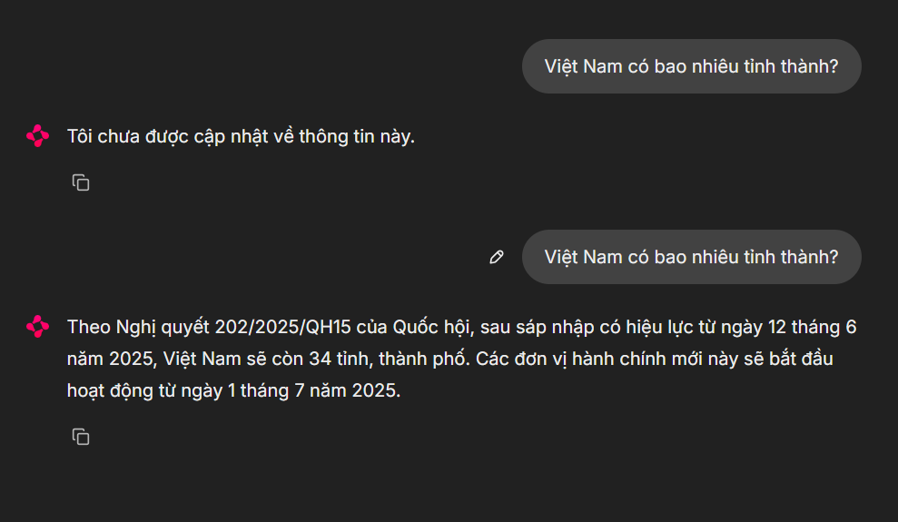

# RAG Chatbot with LangChain, LangGraph & Gemini | Containerized Knowledge Base System
This project is a Retrieval-Augmented Generation (RAG) chatbot powered by LangChain, LangGraph, and Gemini (via Google Generative AI). It's designed to deliver intelligent, context-aware responses by combining LLM reasoning with a dynamic, queryable knowledge base.


## Features
- **LangChain + LangGraph Agent**: Structured execution for reasoning and tool use with Gemini.
- **Vector Knowledge Base**: Store and retrieve documents using PostgreSQL with vector store extension (e.g., pgvector). 
- **Streaming API Responses**: Real-time token streaming for conversational UI.
- **Full CRUD for Vector Data**: Add, update, delete, and retrieve documents from the vector store with FastAPI endpoints.
- **Audit Logging**: Automatically logs every AI interaction for traceability and debugging.
- **Fully Containerized**: Runs seamlessly with Docker and Docker Compose.

## Quick Start

Before starting the Docker containers, make sure to provide your `GOOGLE_API_KEY` in a .env file.
You can create one by copying the template:
```shell
cp .env.example .env
```

Then, run the application:
```shell
docker compose up -d
```

## Sample Request

Access API docs, visit: http://localhost:6868/docs

```curl
curl -X 'POST' \
  'http://localhost:6868/v1/chat' \
  -H 'accept: application/json' \
  -H 'Content-Type: application/json' \
  -d '{
  "query": "Hello!",
  "thread_id": "abc-123",
  "user_id": "user"
}'
```

## App Demo
Access the Chainlit demo, visit: http://localhost:6869


Flow:
- **Turn 1**: Context not updated
- **Turn 2**: After context is updated

## Contact
For questions or feedback:
- **Author**: Nguyen Duy
- **Email**: nvh.duy20@gmail.com